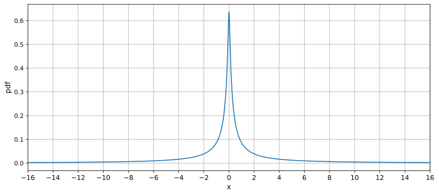
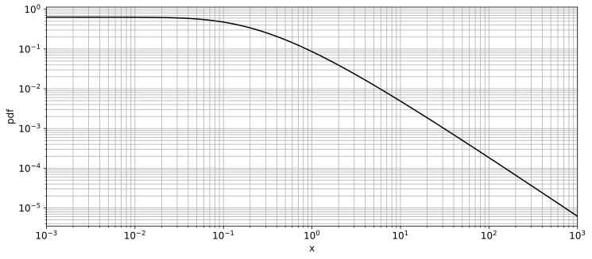
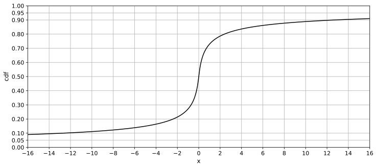
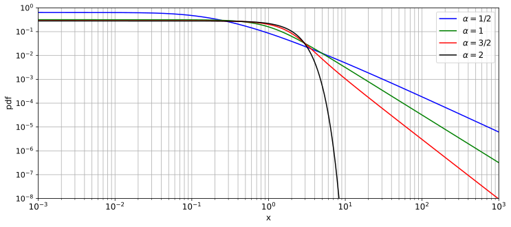

# SASPoint5Distribution
 
This distribution is a special case of a stable distribution with shape parameter &alpha; = 1/2 and skewness parameter &beta; = 0.  
And it does not appear to be widely used.  
*This name "S&alpha;S point5 distribution" is not official but provisional.*

Such a distribution with &beta; = 0 is called symmetric alpha-stable distribution.  
- &alpha; = 2: Normal distribution
- &alpha; = 1: Cauchy distribution

The S&alpha;S point5 distribution, like these distribution, has a closed-from expression, but it can't be expressed in terms of elementary function.  

  
  
  

## Definition
The S&alpha;S point5 distribution, generalized to a stable distribution by introducing position and scale parameters, is as follows:  
  

Since scaling and translations allow for standardization, standard parameters are discussed here.  
  
  

## Numerical Evaluation
Using fresnel integral function, it's obtained as follows:  
This equation becames difficult to obtain accurately when x is extremely small.
  

When x is **extremely** small, the following series expression can also be used:  
  

  

When x is large, the following equation can be used as an asymptotic expression.  
The coefficients decay rapidly, making them suitable numerical evaluation:  
  

  

## Statistics

|stat|x|note|
|----|----|----|
|mean|N/A|undefined|
|mode|0||
|median|0||
|variance|N/A|undefined|
|0.75-quantile|1.283832775189327742808346186911...||
|0.9-quantile|12.74134266157698167806432787517...||
|0.95-quantile|57.30402773063651002282616967046...|
|0.99-quantile|155.9726103725110631926561534085...||
|entropy|3.639924445680306495730849603907...||

## Numeric Table
[PDF Precision 150](results/pdf_precision150.csv)  
[CDF Precision 150](results/cdf_precision150.csv)  
[Quantile Precision 142](results/quantile_precision142.csv)  

## Double Precision (IEEE 754) Approx
[FP64](https://github.com/tk-yoshimura/SaSPoint5DistributionFP64)

## Report
[ResearchGate](https://www.researchgate.net/publication/382124528_Numerical_Evaluation_and_High_Precision_Approximation_Formula_for_SaS_point5_Distribution)  
[TechRxiv](https://www.techrxiv.org/users/661998/articles/1156268-numerical-evaluation-and-high-precision-approximation-formula-for-s%CE%B1s-point5-distribution)  

## S&alpha;S Distributions
  
  

## Reference
[K.I.Hopcraft, E.Jakeman, R.M.J.Tanner, "Lévy random walks with fluctuating step number and multiscale behavior" (1999)](https://journals.aps.org/pre/abstract/10.1103/PhysRevE.60.5327)  

## See Also
[HoltsmarkDistribution](https://github.com/tk-yoshimura/HoltsmarkDistribution)
